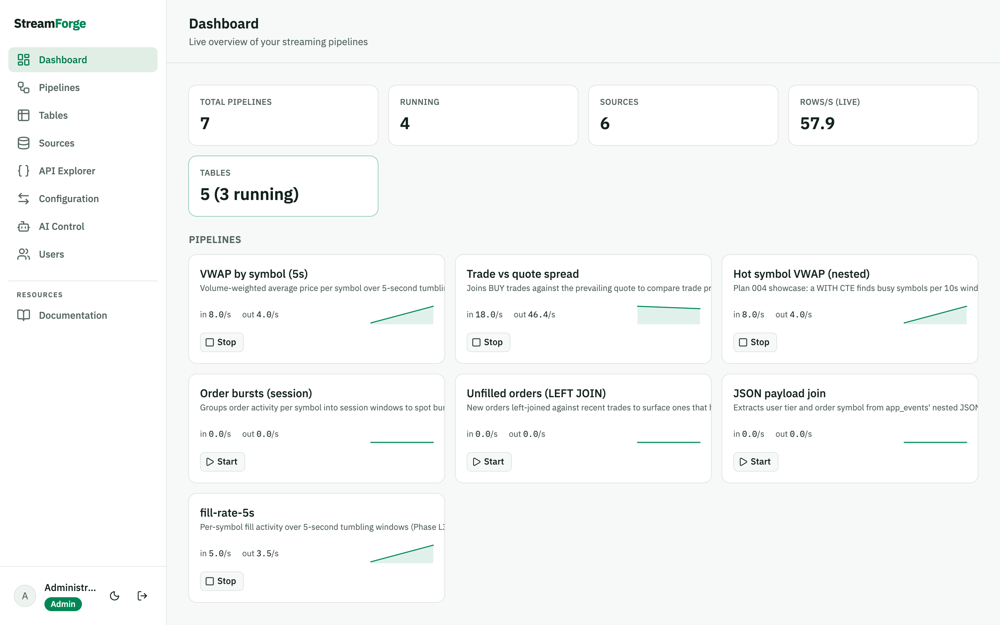
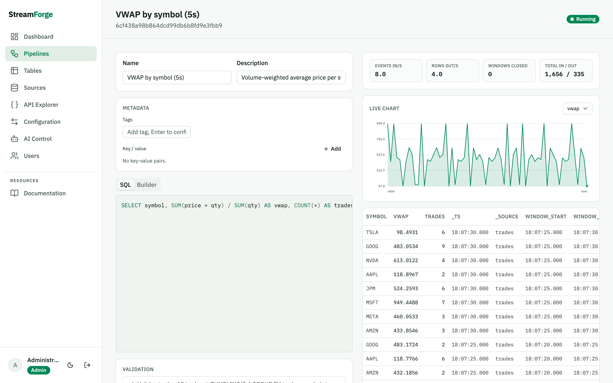
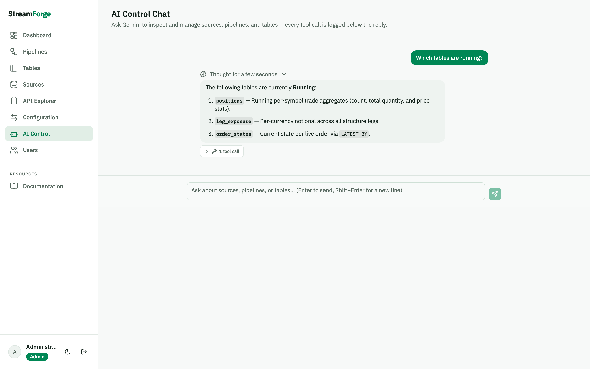

# StreamForge

**Streaming SQL over live event streams — implemented twice, on Microsoft Orleans and on Dapr,
against one shared core.** Write a `SELECT` over a stream, get a continuously-updated result or a
materialized table, watch it change in the browser in real time.

The interesting part isn't that it runs. It's that the *same* SQL engine, REST/SignalR surface and
console run on two very different distributed runtimes — so the comparison between them is measured
rather than argued.



## The measured bit

Same seeded pipeline, same machine, end-to-end (event published → delta visible to a subscriber):

| Transport | tableDelta p50 / p90 / p99 | sourceEvent p50 / p90 / p99 |
|---|---|---|
| Orleans, stock memory streams | 115 / 164 / 190 ms | 45 / 100 / 104 ms |
| **Orleans, push transport** (`--Streams:Transport push`) | **1 / 2 / 6 ms** | **1 / 2 / 7 ms** |
| Dapr, Redis pub/sub | 7 / 9 / 14 ms | 2 / 3 / 7 ms |

Stock Orleans looked 17× slower than Dapr, which is the opposite of what in-process grains should
do. The cause turned out to be structural, not accidental: Orleans' memory streams are **pull**-based,
and the pulling agent's default timer is 100 ms — two hops through it is your p50. Replacing the
provider with an in-process push bus (same provider name, drop-in) puts it where it always should
have been. Full write-up, methodology and the decision matrix:
[**Orleans vs Dapr comparison**](orleans/docs/comparison.html).

## Try it

```bash
docker compose -f deploy/orleans/compose.yaml up   # console on http://localhost:6199
```

Or from source (needs the .NET 10 SDK and [bun](https://bun.sh)):

```bash
cd web && bun install && bun run build && cd ..
dotnet run --project orleans/src/StreamForge.Host   # http://localhost:5199
```

First start seeds a demo world — 6 market-data sources, 7 pipelines, 5 materialized tables — and
three logins: `admin/admin123!`, `editor/editor123!`, `viewer/viewer123!`.

The Dapr flavor is the same console on the same core: `dapr init` once, then `dapr/tools/run.sh`
(http://localhost:5399), or `docker compose -f deploy/dapr/compose.yaml up` for the fully
self-contained stack (app + daprd + placement + redis).

## What it does

**Streaming SQL, two evaluation modes.** *Pipeline mode* is windowed and append-only — tumbling,
hopping and session windows, `WITHIN` joins with `LEFT`/`RIGHT`/`FULL` null-padding, non-recursive
CTEs and subqueries. *Table mode* keeps a materialized, retract-and-assert keyed result: running
aggregates, `LATEST BY`, equi-joins, row-level history, fuzzy row search, and optional partitioned
execution (2–16 partitions with frontier-consistent reads).

```sql
SELECT symbol, SUM(price * qty) / SUM(qty) AS vwap, COUNT(*) AS trades
FROM trades GROUP BY symbol WINDOW TUMBLING(SIZE 5 SECONDS)
```

**A console that shows the dataflow, not just the result** — live charts, per-stage throughput,
row history diffs, an SQL editor with scope-aware autocomplete, and an API explorer.



**Typed access, not just JSON.** Every source, table and compiling pipeline is published as
dynamic protobuf: `GET /api/{kind}/{name}/proto` hands you a self-contained `.proto`, and
`orleans/tools/generate-client.sh` turns it into a built .NET client with a typed
`IAsyncEnumerable` subscription. Field numbers are allocated in the registry and never reused, so generated clients
survive schema edits.

**Polyglot processors** (Dapr flavor). The pub/sub contract is language-agnostic by construction —
[`dapr/processors/`](dapr/POLYGLOT.md) has a Python enricher, a TypeScript consumer and a Java
consumer, each in its own sidecar, each proving the envelope works from outside .NET.

**An AI control plane.** `POST /api/chat` gives Gemini function-calling access to the catalog, so
"which tables are running?" or "create a source at 5 events/sec" are chat messages. Reasoning and
every tool call are shown inline.



## How it's put together

```
shared/     Engine (SQL → dataflow), Contracts, AppCore, Api   ← runtime-agnostic, no Orleans/Dapr types
  ├── orleans/   grains, streams (pull or push), gRPC + dynamic reflection, docs site
  └── dapr/      actors, Redis pub/sub, polyglot processors
web/        React 19 + Tailwind 4 + shadcn console, served by both hosts
```

The Engine is pure: no runtime types cross into it, which is what makes the two-runtime comparison
honest. Everything above it — REST, SignalR, auth, the console — is written once in `shared/` and
registered by both hosts with a single `AddStreamForgeApi()`.

Deeper: [architecture](orleans/ARCHITECTURE.md) · [design rationale](orleans/DESIGN.md) ·
[Dapr flavor](dapr/ARCHITECTURE.md) · [adding a transport](TRANSPORTS.md) ·
[using the native CDC readers, standalone or inside StreamForge](docs/cdc.md) ·
[execution plans the system was built from](plans/README.md).

## What this is not

- **Not a Flink/Materialize competitor.** No exactly-once, no durable state, no recovery story, no
  cluster-wide checkpointing. State lives in grains/actors in one process.
- **Not hardened.** Demo credentials, a development JWT key, cleartext gRPC. See
  [SECURITY.md](SECURITY.md) before exposing it to anyone.
- **Not a stable API.** Contracts evolve additively, but this is a reference implementation, not a
  product with a support commitment.
- **Feature parity between flavors is deliberate, not total.** Partitioned tables and typed gRPC
  serving are Orleans-only today; the [comparison page](orleans/docs/comparison.html) has the full
  parity matrix.

## Tests

```bash
dotnet test orleans/StreamForge.sln     # 897
dotnet test dapr/StreamForge.Dapr.sln   # 181
```

Both suites must be green for any change to `shared/` — that's the regression gate that keeps the
two runtimes honest with each other.

## License

[Apache 2.0](LICENSE).
