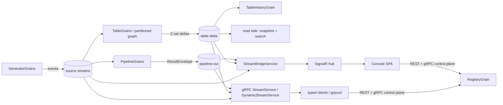

# StreamForge — Architecture (Orleans implementation)

Streaming-SQL platform on Microsoft Orleans 10 / .NET 10. Users declaratively define **sources**
(synthetic generators), **pipelines** (windowed streaming SQL) and **materialized tables**
(incrementally-maintained views) via a console SPA, REST, or gRPC — gated by RBAC, observed live
over SignalR/gRPC streams, and consumable through generated typed client libraries.

This document describes *structure*. Rationale for the non-obvious choices lives in
[DESIGN.md](DESIGN.md); the historical execution plans (with acceptance criteria per phase) are in
[`../plans/`](../plans/README.md). User-facing docs: [`docs/index.html`](docs/index.html), served
at `/docs`.

## Project layout & the reuse boundary

Plan 005 (Dapr sibling runtime) extracted the runtime-agnostic core to repo-root `shared/` so both
flavors — `orleans/` (this document) and `dapr/` (`../dapr/ARCHITECTURE.md`) — build against the
identical Engine/Contracts/AppCore/Api assemblies. Paths below are current as of that extraction;
namespaces inside the moved files are frozen in place (decision D-C, plan 005) even where that
means an Orleans-flavored namespace (e.g. `StreamForge.Host.Grpc.Dynamic`) lives in a shared
assembly — cosmetic, deliberate, and out of scope to rename.

| Project | Depends on | Role |
|---|---|---|
| `../shared/StreamForge.Engine` | **nothing** (pure C#) | SQL compiler + executors + dataflow primitives. **Zero Orleans/Dapr dependencies by design.** *Shared with the Dapr flavor*: reused wholesale, byte-identical — the same `SqlCompiler`/`TableExecutor`/`PipelineExecutor` compile and run every pipeline and table on both runtimes. |
| `../shared/StreamForge.Contracts` | `Microsoft.Orleans.Serialization.Abstractions` (attribute types only, decision D-A) | DTO/model contracts (`Models.cs`, `StreamConstants.cs`), runtime-neutral facade interfaces (`Facades.cs`: `ICatalogFacade`, `IUserStoreFacade`, `IPipelineReadFacade`, `ITableReadFacade`, `ITableHistoryFacade`, `IArrangementMetaFacade`), and the Dapr pub/sub envelope records (`Streaming/Envelopes.cs`). Evolution is **additive-only** (next free `[Id]`). *Shared with the Dapr flavor*: identical DTOs and facade contracts; the Dapr flavor's actor interfaces implement the same facades this repo's grain interfaces inherit. The Orleans `[GenerateSerializer]`/`[Id(n)]` attributes ride along as a benign dependency on the Dapr side (no Orleans runtime, no analyzers) rather than hand-maintaining ~22 parallel surrogate types. |
| `src/StreamForge.Abstractions` | Orleans.Sdk + Contracts | Grain interfaces only (`GrainInterfaces.cs`) — each inherits the matching Contracts facade, so grain proxies double as facade implementations with zero test-visible change. `[assembly: Orleans.GenerateCodeForDeclaringAssembly(typeof(SourceDefinition))]` here generates serializers for the shared Contracts DTOs into this Orleans assembly. **Orleans-only** — the Dapr flavor has no equivalent project; its actor interfaces live directly in `dapr/src/StreamForge.Dapr.Host/Actors/`. |
| `../shared/StreamForge.AppCore` | Engine + Contracts (no Orleans/Dapr) | Orleans-free logic that used to live in this repo's `Host/`: dynamic protobuf machinery (`Protocol/` — descriptor factory, wire encoder, proto file builder), fuzzy/exact search (`Search/`), generator profiles (`Generators/MarketDataProfiles.cs`), row-history retention math (`History/`), `Auth/PasswordHasher`, `Json/JsonValueNormalizer`, and `SeedCatalog` (the demo world both flavors seed identically). *Shared with the Dapr flavor*: reused wholesale — every table/pipeline compiles via the same `Protocol`/`Search`/`History` code on both runtimes, and both seed from the same `SeedCatalog`. |
| `../shared/StreamForge.Api` | Contracts + AppCore (no Orleans/Dapr) | REST endpoints (`Endpoints/*.cs`), the SignalR hub (`Hubs/StreamHub.cs`), JWT issuance (`Auth/JwtTokenService.cs`), and `AddStreamForgeApi`/`MapStreamForgeApi` (auth/policy/CORS/OpenAPI wiring, `/docs`, SPA static-file serving) — bodies reach the catalog/read-side only through the Contracts facades, never a concrete grain or actor type. *Shared with the Dapr flavor*: byte-identical endpoint code; this is what makes the frozen REST/SignalR contract enforced by construction rather than by convention (decision D-B). `/docs` is mapped only when `StreamForgeApiOptions.DocsFilePath` is non-null — the Orleans host is the only one that sets it (see "Surfaces" below). |
| `src/StreamForge.Host` | AppCore + Api + Abstractions + Orleans + ASP.NET | Co-hosted silo + web server (one process): grains (`Grains/`), the Orleans facade-proxy adapters, `Program.cs` wiring. **Orleans-only** — the Dapr counterpart is `dapr/src/StreamForge.Dapr.Host` (actors instead of grains, Redis instead of JSON-file storage). |
| `tests/StreamForge.Engine.Tests` | Engine (+ TestingHost for 2 smoke tests) | ~393 tests: compiler, executors, dataflow, determinism replays. Runs unmodified against `shared/StreamForge.Engine` — this suite is the proof the Engine move was behavior-preserving. |
| `tests/StreamForge.Host.Tests` | Host | ~118 tests: protobuf machinery, history retention, real `TestCluster` integration (seeds, partitioned tables, arrangements, frontiers). |
| `../web/` | — (bun, React 19, Vite, Tailwind v4, shadcn/ui) | Console SPA, moved to repo root in plan 005 W2 (was `orleans/web/`). Talks REST + SignalR only — no Orleans coupling. *Shared with the Dapr flavor*: the exact same built `web/dist` is served by both hosts (`StreamForgeApiOptions.SpaDistPath`) — one build, two runtimes, verified via the frozen `types.ts` ⇔ `Dtos.cs` contract. |

## Engine: SQL → running operators

```
SQL text ──Tokenizer──▶ tokens ──Parser (recursive descent + Pratt exprs)──▶ AST
    ──Validator (scope stack, kinds, positioned diagnostics)──▶ ValidationResult
    ──Planner / TablePlanner (recursive: derived tables nest plans)──▶ CompiledPlan
    ──façade (PipelineExecutor / TableExecutor)──▶ operator chain
```

- **Two compilation modes**, one dialect. *Pipeline* mode: interval joins (`WITHIN`),
  TUMBLING/HOPPING/SESSION windows, `EMIT CHANGES|FINAL`, watermarks. *Table* mode: no windows;
  running aggregates, relational INNER equi-joins over current state, `LATEST BY`.
- **Grammar highlights**: `WITH`/CTEs + derived tables (recursion rejected), `[NOT] IN`/`EXISTS`
  (→ semi/anti joins), scalar subqueries (equality decorrelation), `UNNEST` over array fields,
  Postgres JSON `->`/`->>` with nested typed drill-down, qualified star `alias.*`.
- **Operators** (`Runtime/Ops/`, post-M1 decomposition): pipelines — Join/Window/FilterProject/
  Subquery(rolling-snapshot); tables — Ingest/Join/SemiAnti/Unnest/FilterProject/Reduce/LatestBy.
  Every table op exposes `OnBatch(Epoch, deltas)` / `OnFrontier(Epoch)` with an explicit,
  serializable state object. Executors are façades over these chains; a whole chain embeds as a
  node of another chain (that seam is how derived tables execute).
- **Z-set semantics** (tables): every change is a weighted delta; updates are retract(+old)/
  assert(+new) pairs; joins are bilinear; aggregates subtractable (multiset MIN/MAX). This is
  DBSP-style incremental view maintenance — correct under updates, not just appends.
- **Dataflow primitives** (`Dataflow/`): `Epoch`, `DeltaBatch`, `FrontierTracker` (min-combine,
  regression-detecting), `ExchangeRouter` (FNV-1a, process-stable), `EpochBuffer` (deterministic
  reorder/flush) — the protocol layer for partitioned execution, plus `TableDataflowPlan` (stage/
  edge graph with routing specs) and `ArrangementKeySpec`.

## Grain topology (Host)

| Grain | Key | Persisted | Role |
|---|---|---|---|
| `RegistryGrain` | `"catalog"` | yes | Source/pipeline/table catalogs + CRUD + start/stop orchestration; seeds on empty storage; resumes Running entities on boot (topo-sorted for table chains); owns the **field-number map** for dynamic protobuf; `[MayInterleave]` allowlist on read methods (see DESIGN — reentrancy). |
| `GeneratorGrain` | source name | no | Grain-timer synthetic event publisher (`trades`/`quotes`/`orders`/`json-events`/`multileg`/`lifecycle` profiles) → `("sources", name)` stream. |
| `PipelineGrain` | pipeline id | yes | Compiles SQL, subscribes source streams, runs a `PipelineExecutor` per event + 500 ms watermark timer, publishes `ResultEnvelope` batches → `("pipeline-out", id)`. |
| `TableGrain` | table name | yes | **Two modes.** Classic (`Parallelism == 1`): runs the whole `TableExecutor` in-grain, publishes deltas → `("table-delta", name)`, maintains consolidated snapshot (write-behind JSON) + search index. Coordinator (`Parallelism ≥ 2`): deploys/tears down the partitioned graph below and serves reads from deltas it consumes back. |
| `TableIngestGrain` | `{table}:{input}` | no | Subscribes a real input stream, stamps **epochs** (250 ms tick or 1000 events), routes batches into stage-0 partitions. |
| `TableStageGrain` | `{table}:{stage}:{partition}` | no | One partition of one operator stage: `FrontierTracker` + `EpochBuffer` + engine stage executor; processes on frontier advance; routes outputs downstream (hash-exchange on join/group keys, broadcast for scalar sides), all batched per `(edge, epoch)`. |
| `TableOutputGrain` | table name | no | Terminal gather: publishes to the table-delta stream **and** pushes `(partition, epoch)`-tagged batches to the coordinator for frontier-consistent reads. |
| `ArrangementGrain` | `{input}:{keySpecHash}:{partition}` | yes (checkpoint) | Shared indexed input state: refcounted attach/detach, snapshot-then-deltas handoff, checkpoint every ~10 s, GC at zero consumers. Two tables joining the same source on the same key share one arrangement set. |
| `TableHistoryGrain` | table name | yes | Opt-in row-version history fed by the table-delta stream (the stream *is* the event log): All/LastN/FirstN/MinBy/MaxBy retention + time window; row identity from GROUP BY/LATEST BY keys. |
| `UserStoreGrain` | `"users"` | yes | PBKDF2 credentials, seeded admin/editor/viewer. |

**Streams** (Orleans memory streams, provider `"streams"`): namespaces `sources`, `pipeline-out`,
`table-delta`, `lifecycle`. `StreamBridgeService` (hosted service) relays them to SignalR groups.
**Persistence**: custom `JsonFileGrainStorage` — one JSON file per grain state under `data/`
(config `DataDir`); delete the directory to reseed.

## Partitioned table execution (opt-in, `Parallelism 2–16`)

```
source stream ─▶ TableIngestGrain ──epoch-stamped batches──▶ TableStageGrain grid ─▶ TableOutputGrain
                    (or shared ArrangementGrain for arrangeable join inputs)            │
                                                                                       ▼
   reads (rows/search/metrics) ◀── TableGrain coordinator ◀── frontier-tagged batches + delta stream
```

- Epochal DBSP model (unitemporal): frontiers advance per stage-partition; a batch is processed
  only when every upstream has passed its epoch; outputs flush deterministically.
- **Frontier-consistent reads**: the coordinator applies terminal batches atomically per epoch;
  `/rows` returns `frontierEpoch` — rows reflect *all* deltas ≤ F and none beyond, by construction.
- Late data: epoch-stamped at arrival, never dropped at the dataflow layer (business-time
  ordering is a query concern — e.g. `LATEST BY` compares row timestamps).
- Recovery: snapshots serve immediately; operator state rebuilds from live traffic
  (`Rebuilding` flag); arrangements additionally checkpoint.
- Measured (soak, 2 000 ev/s × 60 s): P=4 p99 latency **0.70×** the single-grain baseline
  (higher median from epoch batching, radically tighter tail — the point of the design).

## Surfaces (one process, two ports)

| Surface | Where | Notes |
|---|---|---|
| REST | `:5199 /api/*` | Full CRUD + validate + rows/search/history/metrics + proto downloads + `/api/meta/*`. JWT (HS256, 12 h), policies Viewer ⊂ Editor ⊂ Admin. OpenAPI at `/openapi/v1.json`, interactive reference at `/scalar`. |
| SignalR | `:5199 /hubs/stream` | Per-entity subscriptions (`pipeline:{id}`, `source:{name}`, `table:{name}`, `metrics`); token via `access_token` query. |
| SPA + docs | `:5199 /`, `/docs`, `/explorer` | Console (the client branding, light default, `sf.theme`), interactive user docs, API Explorer (reflection surface UI). |
| gRPC | `:5299` (cleartext h2c) | Static control plane `streamforge.v1` (CRUD/validate/Struct-row streaming) + hand-implemented **dynamic reflection**: every source/table/compiling-pipeline published as typed `streamforge.dynamic.v1` messages; `DynamicStreamService.SubscribeEntity` streams typed `{Entity}Event`/`{Entity}Delta` bytes. Same JWT as metadata. |
| Typed clients | `GET /api/{kind}/{id-or-name}/proto` + `tools/generate-client.sh` | Self-contained proto3 per entity → scaffolded, built .NET client lib with typed `IAsyncEnumerable` subscribe. Field numbers persist in the registry (evolution-safe, never reused) so generated clients survive schema edits. |

## Request/data flow (one glance)



## Build / run / verify

```bash
~/.dotnet/dotnet test orleans/StreamForge.sln          # 511 tests
cd web && bun run build                                # SPA (bun only, never npm)
~/.dotnet/dotnet run --project orleans/src/StreamForge.Host   # :5199 + :5299
# config: --Http:Port --Grpc:Port --DataDir   ·  logins: admin/editor/viewer + "123!"
```
